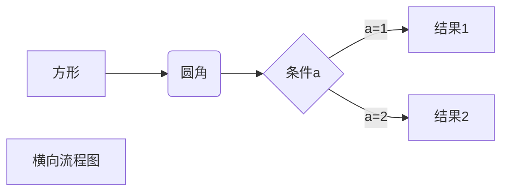
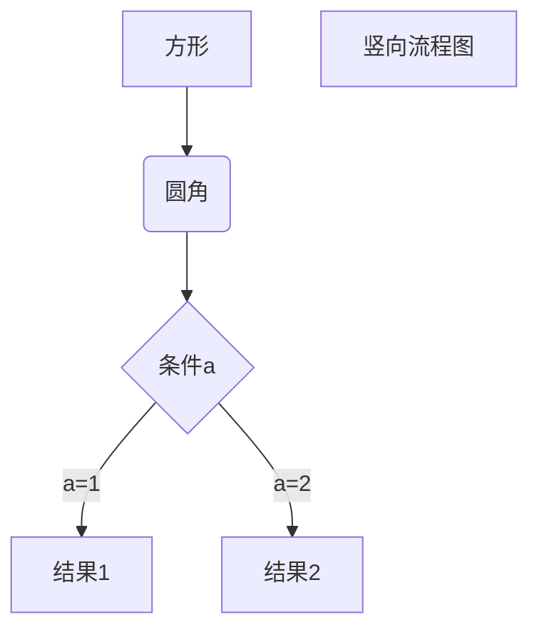
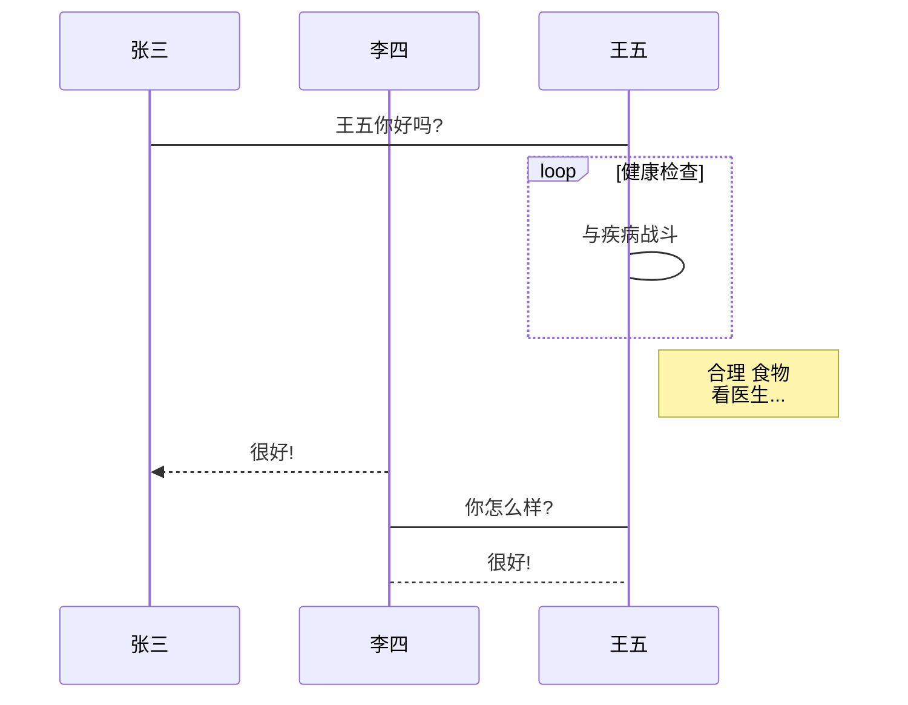
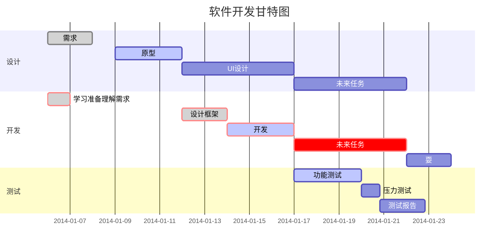

# markdown

**Markdown**是一种轻量级**标记语言**，它以纯文本形式(*易读、易写、易更改*)编写文档，并最终以HTML格式发布。    

它由[**Aaron Swartz**](http://www.aaronsw.com/)和**John Gruber**共同设计，**Aaron Swartz**就是那位于去年（*2013年1月11日*）自杀,有着**开挂**一般人生经历的程序员。维基百科对他的[介绍](http://zh.wikipedia.org/wiki/%E4%BA%9A%E4%BC%A6%C2%B7%E6%96%AF%E6%B2%83%E8%8C%A8)是：**软件工程师、作家、政治组织者、互联网活动家、维基百科人**。   


**相关资料**

- [项目地址](https://daringfireball.net/projects/markdown/)

## 标题

```markdown
# 一级标题
## 二级标题
### 三级标题
#### 四级标题
##### 五级标题
###### 六级标题

我展示的是一级标题
=================

我展示的是二级标题
-----------------
```
## 段落

```markdown

留空白的换行，将会被自动转换成一个段落，

会有一定的段落间距，便于阅读。

```
## 强调

```markdown
斜体
_斜体_
_斜体_

加粗
**加粗**
**加粗**

粗斜体
***粗斜体***
___粗斜体___

~~删除线~~

<u>带下划线文本</u>

高亮
`code`

<span style="color:red">红色字体</span>
```

## 转义

```markdown
**文本加粗** 
\*\* 正常显示星号 \*\*
```

## 列表

```markdown
## 无序列表

* 第一项
  * 第一项的第一项
* 第二项

+ 第一项
+ 第二项


- 第一项
- 第二项

## 有序列表

1. Node.js
  1. Express
  2. Koa
  3. Sails
2. Ruby
  1. Rails
  2. Sinatra
3. Go

## 任务列表

- [ ] a task list item
- [ ] list syntax required
- [ ] normal **formatting**, @mentions, #1234 refs
- [ ] incomplete
- [x] completed
```

## 代码块

~~~markdown
    4个空格开头或者一个制表符(Tab 键)就可以
    标记一个代码块

```
代码块
```

```js
codeFences.withLanguage() //有指定语言的语法高亮显示
```
~~~

```markdown

~~~bash
echo 我也是代码块
~~~

```

## 图片

```makrkdown


[img]: http://foo.com/img.jpg
```

## 链接

```markdown
[link](http://google.com)
[link][google]
[google]: http://google.com
<http://google.com>
```

## 表格

```markdown
| 头部1 | 头部2 |
| ----- | ----- |
| 内容1 | 内容2 |

| 左对齐 | 右对齐 | 居中对齐 |
| :-----| ----: | :----: |
| 单元格 | 单元格 | 单元格 |
| 单元格 | 单元格 | 单元格 |
```

## 横线

```markdown
***

* * *

*****

- - -

----------
```

## 引用

```markdown
> 这是
> 一条引用
>
> > 嵌套
> > 引用

> 引用中使用列表
> 1. 第一项
> 2. 第二项
> + 第一项
> + 第二项
> + 第三项
```

## 嵌入html

```
使用 <kbd>Ctrl</kbd>+<kbd>Alt</kbd>+<kbd>Del</kbd> 重启电脑


<table>
  <tr>
    <td>1</td>
    <td>2</td>
  </tr>
  <tr>
    <td>3</td>
    <td>4</td>
  </tr>
</table>


<div align="center">
居中显示
</div>
```

## 脚注
```markdown
脚注[^脚注].

[^脚注]: **脚注**.
```

## 视频
```markdown
<video src="xxx.mp4" />
```

## Emoji 
```markdown

:smile: :laughing: :dizzy_face: :sob: :cold_sweat: :sweat_smile:  :cry: :triumph: :heart_eyes: :relaxed: :sunglasses: :weary:

:+1: :-1: :100: :clap: :bell: :gift: :question: :bomb: :heart: :coffee: :cyclone: :bow: :kiss: :pray: :sweat_drops: :hankey: :exclamation: :anger:

```

## MathJax

```markdown
$$
\mathbf{V}_1 \times \mathbf{V}_2 =  \begin{vmatrix}
\mathbf{i} & \mathbf{j} & \mathbf{k} \\
\frac{\partial X}{\partial u} &  \frac{\partial Y}{\partial u} & 0 \\
\frac{\partial X}{\partial v} &  \frac{\partial Y}{\partial v} & 0 \\
\end{vmatrix}
$$
```

##　流程图

~~~markdown
## 横向流程图


## 竖向流程图


##　标准流程图源码格式
```flow
st=>start: 开始框
op=>operation: 处理框
cond=>condition: 判断框(是或否?)
sub1=>subroutine: 子流程
io=>inputoutput: 输入输出框
e=>end: 结束框
st->op->cond
cond(yes)->io->e
cond(no)->sub1(right)->op
```

## 标准流程图源码格式(横向)
```flow
st=>start: 开始框
op=>operation: 处理框
cond=>condition: 判断框(是或否?)
sub1=>subroutine: 子流程
io=>inputoutput: 输入输出框
e=>end: 结束框
st(right)->op(right)->cond
cond(yes)->io(bottom)->e
cond(no)->sub1(right)->op
```

## UML时序图源码
```sequence
对象A->对象B: 对象B你好吗?(请求)
Note right of 对象B: 对象B的描述
Note left of 对象A: 对象A的描述(提示)
对象B-->对象A: 我很好(响应)
对象A->对象B: 你真的好吗?
```

## UML时序图源码复杂
```sequence
Title: 标题：复杂使用
对象A->对象B: 对象B你好吗?(请求)
Note right of 对象B: 对象B的描述
Note left of 对象A: 对象A的描述(提示)
对象B-->对象A: 我很好(响应)
对象B->小三: 你好吗
小三-->>对象A: 对象B找我了
对象A->对象B: 你真的好吗?
Note over 小三,对象B: 我们是朋友
participant C
Note right of C: 没人陪我玩
```

## UML标准时序图


## 甘特图样例

~~~